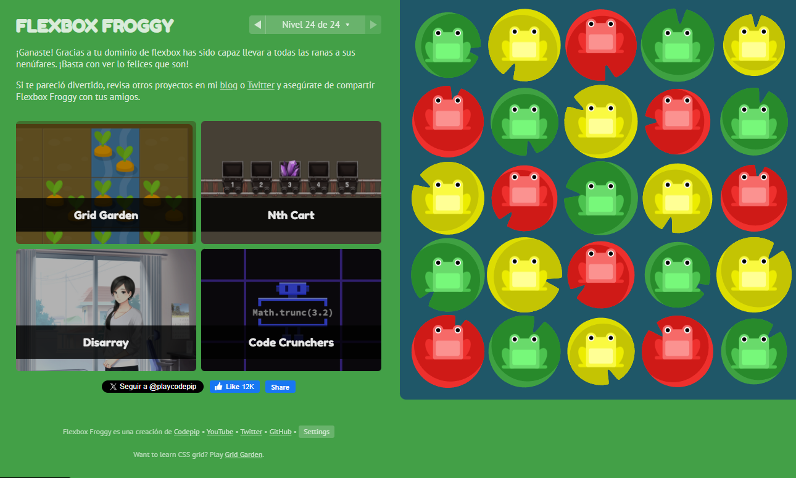
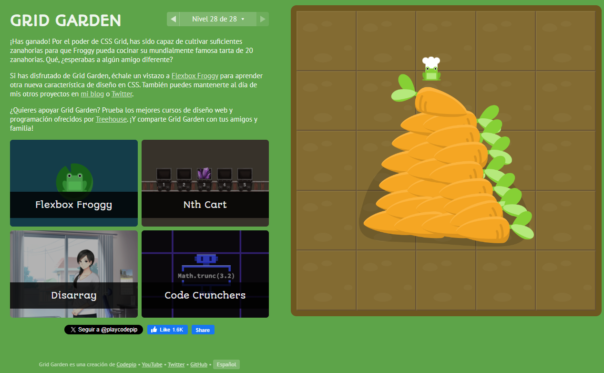
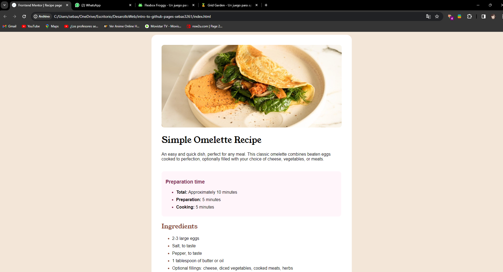

# Mi primera página en internet
Este será el repositorio que usarán para subir su primera página a internet a través de Github Pages.

Para esto es necesario que suban los cambios de su repositorio anterior a este repositorio, los pasos son los siguientes:
- Tienen que añadir un nuevo repositorio remoto a su repositorio local, esto quiere decir que además de tener un **origin** tendrán otro (ustedes deciden como nombrarlo).
  - Para esto pueden usar el comando `git remote add [NOMBRE_DE_REFERENCIA_DEL_NUEVO_REMOTO] https://github.com/NUEVO_REPOSITORIO_REMOTO.git` tal como se muestra en este [ejemplo](https://articles.assembla.com/en/articles/1136998-how-to-add-a-new-remote-to-your-git-repo).
  - Una vez agreguen el nuevo remoto, deben hacer push.
     - En lugar de hacer `git push origin master` deberán usar el nombre del nuevo remoto, es decir: `git push NOMBRE_DE_REFERENCIA_DEL_NUEVO_REMOTO master`

A continuacion se encuentran los pantallasos de los juegos terminados para mejorar la habilidad con el uso de css
Flexbox Frogy:

Grid Garden

y el preview de como se ve la pagina web desplegada

## Sitio web Desplegado
El taller estará finalizado una vez suban su página a internet y agregue a continuación el link:
- **Link del sitio web desplegado: https://dsaw-2024-1.github.io/intro-to-github-pages-sebas3261/**
